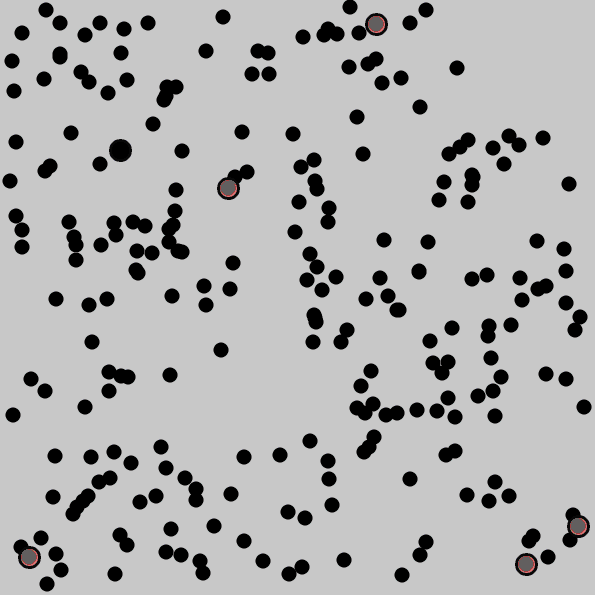
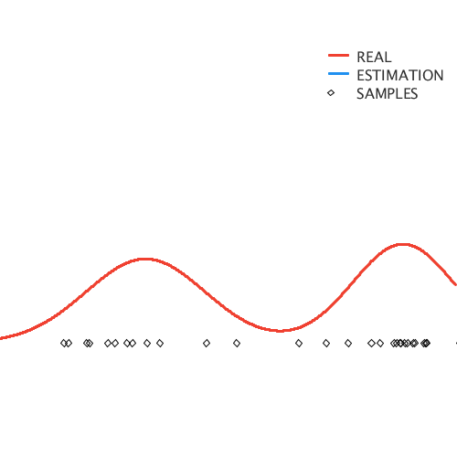

Algorithms Illustration
================================

Illustrating several machine learning algorithms using animation made by processing/Java.

## Usage
-----

Run "xxx-demo.pde" using Processing IDE.
  
  
## Preview
-------

### K-means clustering
  

Points are randomly divided into 6 initial clusters. After several iterations of k-means algorithm, each point goes into the most appropriate cluster.

### EM (Expectation Maximization)

